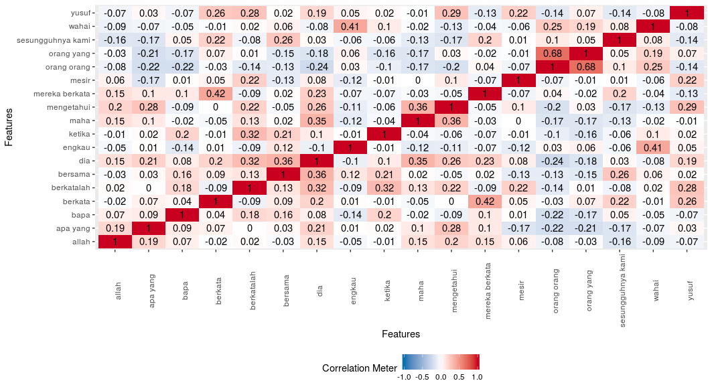

# Al-Quran Karim NLP using R (Malay Language)



* Al-Quran Karim Malay keyword analysis using R
* The Malay translation source is from - http://www.surah.my . Thanks.
* Original arabic version is from - https://github.com/niarepo/quran-nlp . Thanks

## Changes Log
* 1.0 - Committing code to github

## Tools
* FME Desktop
* RStudio
* R 3.4.4
* Zorin 12.1 Linux

## Installation

Use the R , please install below components

```r
library(curl)
library(rvest)
library(dplyr)
library(stringr)
library(RSQLite)
library(DataExplorer)
library(tm)
library(wordcloud)
library(quanteda)
```

## Usage

In progress

## Contributing
Pull requests are welcome. For major changes, please open an issue first to discuss what you would like to change.
Please make sure to update tests as appropriate.

## License
[FREE](https://opensource.org/licenses)
