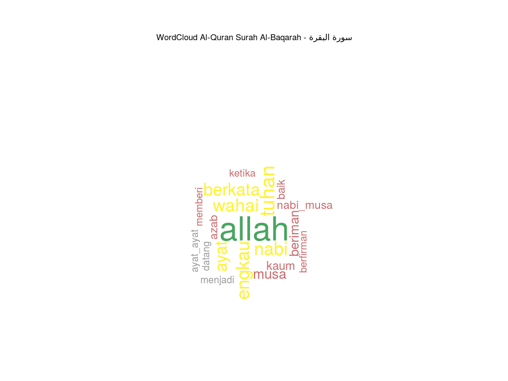
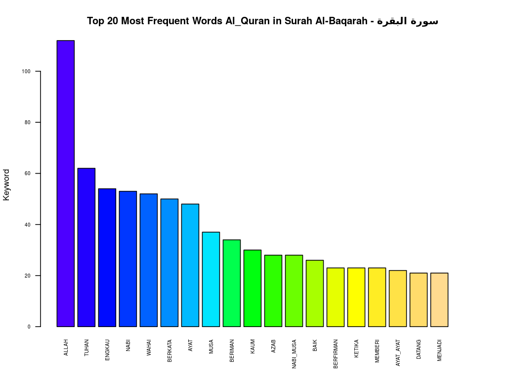
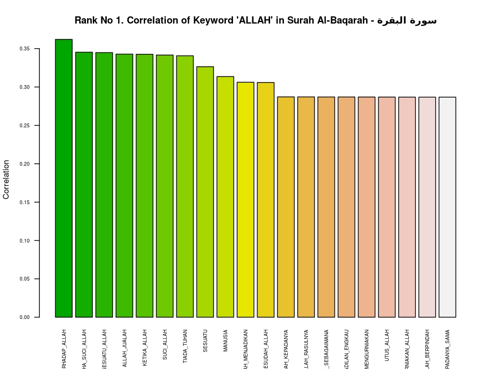
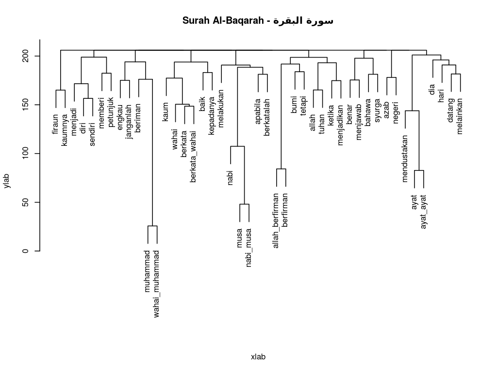

# Al-Quran Karim NLP in (Malay Language) using R 






* Al-Quran Karim Malay keyword analysis using R
* The Malay translation source is from - http://www.surah.my . Thanks.
* Original arabic version is from - https://github.com/niarepo/quran-nlp . Thanks

## Other related research
* https://blog.cinqmarsmedia.com/is-islam-a-religion-of-peace-aea607622476
* https://www.kaggle.com/zusmani/the-holy-quran/discussion/42994
* https://ieeexplore.ieee.org/document/8566248
* http://abdulbaqi.io/2019/01/15/quranic_roots/
* http://textminingthequran.com/
* https://www.researchgate.net/publication/321165167_Natural_Language_Processing_Approach_for_Searching_the_Quran_Quick_and_Intuitive
* https://nlp.stanford.edu/~johnhew/structural-probe.html
* https://towardsdatascience.com/getting-to-grips-with-parse-trees-6e19e7cd3c3c

## Changes Log
* 1.0 - Committing code to github

## Tools
* FME Desktop
* RStudio
* R 3.4.4
* Zorin 12.04 Ubuntu Linux

## Installation

Please install below R library/packages before excecute the R code

```r
library(curl)
library(rvest)
library(dplyr)
library(stringr)
library(RSQLite)
library(DataExplorer)
library(tm)
library(wordcloud)
library(quanteda)
```

## Usage
In progress

## Contributing
Pull requests are welcome. For major changes, please open an issue first to discuss what you would like to change.
Please make sure to update tests as appropriate.

## License
[FREE](https://opensource.org/licenses)

## Contact
Please drop email to akunyer[A]gmail.com
